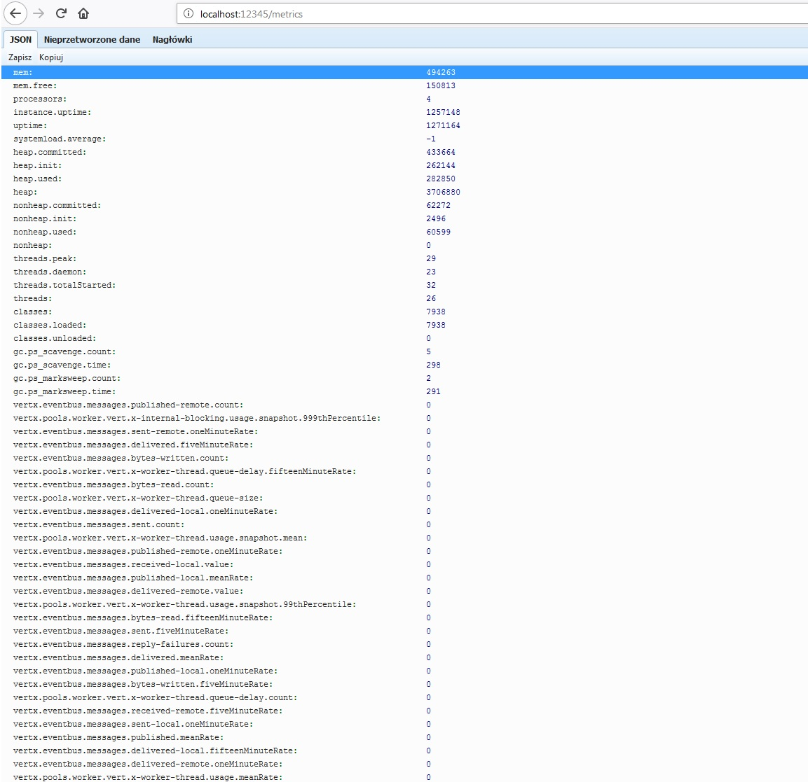
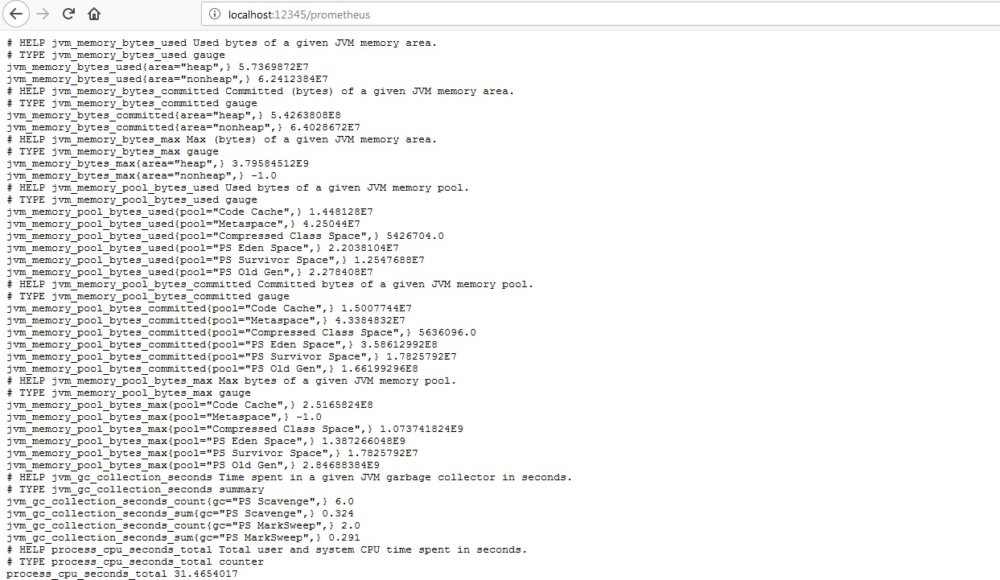

# Dropwizard Metrics for Spring-boot and Vert.x

Example how to combine Spring-boot and Vert.x metrics together. 
Complete working application can be found [here](https://github.com/bartoszjkwozniak/spring-boot-vertx-dropwizard-metrics).

## Spring-boot metrics

When having up and running spring-boot application all you need to do to gain insight to metrics is actuator:
```
    <dependency>
        <groupId>org.springframework.boot</groupId>
        <artifactId>spring-boot-starter-actuator</artifactId>
    <dependency>
```

Just that adds new endpoint `/metrics` where you can view out-of-the-box metrics, 
providing basic information about your service in JSON format.

## Vert.x metrics

When creating `Vertx` object you can specify `VertxOptions` and pass it to the `Vertx` constructor.
Second, `VertxOptions` has function `setMetricsOptions`. 
To enable Vert.x metrics you need to use `setEnabled(true)` and `setJmxEnabled(true)`
functions on `DropwizardMetricsOptions` object and pass this object to `setMetricsOptions` function. 

```java
    Vertx.vertx(
        new VertxOptions(
            new DropwizardMetricsOptions()
            .setEnabled(true)
            .setJmxEnabled(true)
        )
    )
```

Now Vert.x metrics are available by connecting via JMX and exploring mbeans.

## vertx-dropwizard-metrics 3.6.0

Next step requires vertx-dropwizard-metrics library version 3.6.0.
As I am writing this, version 3.6.0 is not released yet,
therefore you need to download master branch from vertx-dropwizard-metrics 
[official repository](https://github.com/vert-x3/vertx-dropwizard-metrics)
and perform mvn install command.

After that you can use the newest version by adding following dependency to pom.xml file:

```
    dependency>
        <groupId>io.vertx</groupId>
        <artifactId>vertx-dropwizard-metrics</artifactId>
        <version>3.6.0-SNAPSHOT</version>
    </dependency>
```

## Spring-boot and Vert.x metrics together

In order to combine Spring-boot and Vert.x metrics together autowire `MetricRegistry` object used by Spring-boot
and pass it as parameter to `setMetricRegistry` function for `DropwizardMetricsOptions` object.

Code below:

```java
@Component
public class VertxConfig {
    @Autowired
    private MetricRegistry metricRegistry;

    @Bean
    public Vertx vertx(){
        return Vertx.vertx(getVertxOptions());
    }

    private VertxOptions getVertxOptions(){
        VertxOptions options = new VertxOptions();
        DropwizardMetricsOptions dropwizardMetricsOptions = new DropwizardMetricsOptions()
                .setEnabled(true)
                .setJmxEnabled(true)
                .setMetricRegistry(metricRegistry);
        options.setMetricsOptions(dropwizardMetricsOptions);
        return options;
    }
}
```

Now you can see those metrics together under one `/metrics` endpoint:


## Additional endpoint for prometheus

[Prometheus](https://prometheus.io/) is and open-source monitoring solution that can read metrics from your service.
It requires metrics to be in particular format. Let's see how this can be achieved.

First, we need to add few dependencies:
```
    <dependency>
        <groupId>io.prometheus</groupId>
        <artifactId>simpleclient_spring_boot</artifactId>
        <version>${ioprometheus.version}</version>
    </dependency>
    <dependency>
        <groupId>io.prometheus</groupId>
        <artifactId>simpleclient_hotspot</artifactId>
        <version>${ioprometheus.version}</version>
    </dependency>
    <dependency>
        <groupId>io.prometheus</groupId>
        <artifactId>simpleclient_dropwizard</artifactId>
        <version>${ioprometheus.version}</version>
    </dependency>
```

And after that we need to create `PrometheusConfig` configuration class:

```java
@Configuration
@EnablePrometheusEndpoint
public class PrometheusConfig {

    @Autowired
    private MetricRegistry metricRegistry;

    @PostConstruct
    public void registerPrometheusCollectors() {
        CollectorRegistry.defaultRegistry.clear();
        new ClassLoadingExports().register();
        new GarbageCollectorExports().register();
        new MemoryPoolsExports().register();
        new StandardExports().register();
        new ThreadExports().register();
        new VersionInfoExports().register();
        new DropwizardExports(metricRegistry).register();
    }
}
```

And that's it! You can view your application metrics under new endpoint `/prometheus`.
